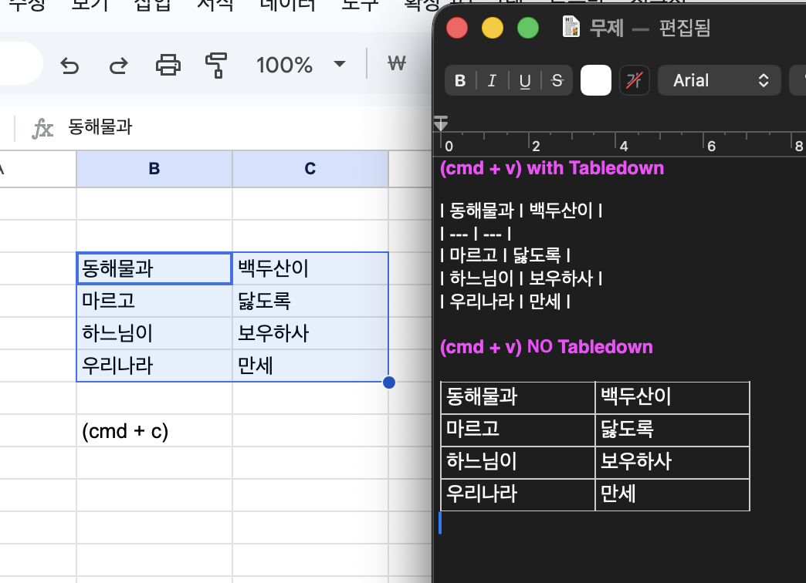

# Tabledown

<p align="center">
  
</p>

<p align="center">
  <a href="https://apps.apple.com/app/id6768205551"></a>
  <a href="https://github.com/yooongZa/tabledown/releases/latest"></a>
  
  
</p>

<p align="center">
  <a href="README.en.md">English</a> | 한국어
</p>

> 스프레드시트 표를 Markdown source(마크다운 원문)로 바꿔주는 macOS menu bar(메뉴바) 앱

Tabledown은 Excel/Google Sheets에서 복사한 표를 Obsidian, GitHub README, Markdown editor(마크다운 에디터)에 붙이기 좋은 `| ... |` 표로 바꿔줍니다. 별도 창을 열거나 export(내보내기)하지 않고, 평소처럼 `Cmd+C`와 `Cmd+V`만 사용합니다.

## 다운로드

Mac App Store에서 받는 것을 권장합니다 (자동 업데이트).

<p>
  <a href="https://apps.apple.com/app/id6768205551">
    
  </a>
</p>

또는 GitHub Releases(깃허브 릴리스)에서 직접 받을 수 있습니다.

**[Tabledown.dmg 다운로드](https://github.com/yooongZa/tabledown/releases/latest/download/Tabledown.dmg)**

설치 (DMG):

1. `Tabledown.dmg` 열기
2. `Tabledown.app`을 Applications(응용 프로그램)로 드래그
3. 앱 실행 후 메뉴바의 table(표) 아이콘 확인

배포용 DMG는 Developer ID signing(개발자 ID 서명)과 Apple notarization(애플 공증)을 통과한 빌드입니다. Mac App Store 빌드는 App Sandbox(앱 샌드박스)에서 동작합니다.

## 왜 쓰나요

| 입력 | 붙여넣는 곳 | 출력 |
|------|------------|------|
| Excel/Google Sheets 표 (`Cmd+C`) | Obsidian/GitHub/마크다운 에디터 (`Cmd+V`) | Markdown 원문 표 |
| 마크다운 표 (`Cmd+C`) | Excel (`Cmd+V`) | 셀에 분리된 표 |
| Excel 표 범위 선택 후 메뉴 ‘선택한 표를 XML로 복사’ 또는 `⌘⌃X` | LLM 프롬프트 (`Cmd+V`) | 병합 계층을 보존한 LLM 친화 XML |
| Excel 수식 영역 선택 후 메뉴 ‘표의 수식을 포함해 XML로 복사’ 또는 `⌘⌃E` | LLM 프롬프트 (`Cmd+V`) | 셀 값·빈칸·주소·A1/R1C1 수식·직접 참조값 XML |

Tabledown을 켜 두면 Obsidian 같은 Markdown editor(마크다운 에디터)에서 spreadsheet(스프레드시트) 표가 Markdown source(마크다운 원문)로 붙습니다.

```markdown
| 이름 | 할 일 |
| --- | --- |
| Tabledown | 표를 Markdown으로 붙이기 |
```

Tabledown은 clipboard(클립보드)의 text(일반 텍스트) 슬롯에 Markdown을 보강하고 HTML table(HTML 표) 슬롯은 그대로 유지합니다 (0.2.4부터). 붙여넣는 앱이 자기에게 맞는 형식을 고르기 때문에, 한 번 복사한 표가 Markdown editor에서는 Markdown source로, TextEdit·Word·Excel 같은 rich text editor(서식 있는 텍스트 편집기)에서는 렌더링된 표로 붙습니다.

<p align="center">
  
</p>

위 스크린샷은 같은 표가 붙는 두 가지 결과 — Markdown source(위)와 렌더링된 표(아래) — 를 보여줍니다. (0.2.4 이전 버전 캡처라 켬/끔으로 나뉘어 있지만, 지금은 두 형식이 clipboard에 공존하며 도착지 앱이 선택합니다.) 즉 Tabledown은 "예쁜 표 렌더러"가 아니라 "Markdown 문서용 표 변환기"입니다.

## XML 변환 (LLM 친화)

LLM 프롬프트에 표를 넣을 때 잘 인식되는 **다단 헤더 중첩 XML**을 지원합니다. 다단(그룹) 헤더를 XML 중첩 계층으로 그대로 보존합니다 — 루트는 `<표>`, 세로 그룹은 `<{헤더}그룹 이름="값">`, 행은 `<행 {헤더}="값">`, 가로 그룹은 `<열그룹 이름="값">`, 셀은 `<열 n="헤더값">셀값</열>`.

예: 세로 2단(직급▸부장/차장, 직책) × 가로 2단(1분기▸1,2,3 / 2분기▸4,5,6) 교차표.

```xml
<표>
  <직급그룹 이름="부장">
    <행 직책="대족장">
      <열그룹 이름="1분기"><열 n="1">동</열><열 n="2">해</열><열 n="3">물</열></열그룹>
      <열그룹 이름="2분기"><열 n="4">과</열><열 n="5">백</열><열 n="6">두</열></열그룹>
    </행>
    <행 직책="족장"> … </행>
    <행 직책="추장"> … </행>
  </직급그룹>
  <직급그룹 이름="차장"> … </직급그룹>
</표>
```

- **선택한 Excel 표 → XML (메뉴·⌘⌃X)**: Excel desktop app(데스크톱 앱)에서 하나의 사각형 표 범위를 선택한 뒤 메뉴바의 **‘선택한 표를 XML로 복사’** 를 누르거나 전역 단축키 **⌘⌃X** 를 누릅니다. `Cmd+C`를 먼저 누르지 않아도 Excel 화면의 숫자·날짜·퍼센트·통화·사용자 지정 서식과 오류값, 데이터 text의 앞뒤·연속 공백, 빈칸·병합 구조를 직접 읽어 LLM 친화 XML로 복사합니다. 데이터 셀에서 문자 그대로의 `<br>`와 실제 셀 줄바꿈도 구분해 보존합니다. 이전 clipboard 표로 fallback(대체)하지 않으므로 오래된 복사본이 변환될 수 없습니다. 성공하면 메뉴바 아이콘이 1초간 체크 표시로 바뀌고, 어디에 붙여도 XML이 나오도록 기존 clipboard 형식을 plain text XML로 교체합니다. Google Sheets·LibreOffice·clipboard의 Markdown/XML은 이 수동 명령의 입력으로 지원하지 않습니다. 자동 XML→표 역변환도 두지 않습니다.
- **안정된 선택만 내보냄**: 선택 영역·셀 값·병합 구조를 두 번 연속 읽어 같은 snapshot(스냅샷)일 때만 clipboard를 씁니다(최대 3회). 서로 떨어진 다중 영역, **10,000셀 초과**, 선택 경계를 걸친 병합 셀, 읽는 동안 바뀐 표는 안내 후 중단하며 기존 clipboard를 보존합니다. Excel이 좁은 열이나 표시 불가 날짜·시간 때문에 값을 `##`로 표시하는 경우도 손상된 text를 내보내지 않고 전체 값이 보이도록 수정할 것을 안내합니다(실제로 입력한 문자 `##`는 그대로 보존). 병합 영역은 Excel에서 batch(일괄)로 읽어 정확한 구조를 유지하며, 일반 XML과 수식 XML의 선택 한도는 같습니다.
- **가로·세로 그룹 모두 중첩**: 가로 다단 헤더는 `<열그룹>` 으로, 세로 그룹(직급 부장/차장)은 `<{헤더}그룹>` 으로 중첩해 표의 계층을 그대로 보존합니다. 가로 헤더는 태그가 아니라 `n=`/`이름=` 속성에 넣어 공백·기호·숫자가 있어도 태그가 망가지지 않고 어떤 표준 XML 파서로도 안전합니다. 루트가 한글 `<표>` 라 브라우저·Obsidian 미리보기처럼 HTML 로 렌더링되는 곳에서도 내용이 사라지지 않습니다.
- **세로 그룹은 부모 노드로 중첩 (이전 버전과 달라진 점)**: 이전 버전은 세로 키 열(직급)을 각 행에 반복해 채워 행 하나하나가 자기완결 레코드였습니다. 지금은 세로 그룹을 부모 노드(`<직급그룹>`)로 중첩합니다 — 계층은 그대로 보존되지만 그룹 값이 부모에만 있어, **행 하나만 떼면 그 행만으로는 직급을 알 수 없습니다**(자기완결성 대신 계층 보존을 택한 의도된 변경).
- **‘빈칸을 자동 채우기’ (설정 ▸, 기본 꺼짐)**: 병합 없이 빈칸으로 그룹을 표현한 표를 변환할 때, 마크다운·XML **두 변환 경로 공통**으로 왼쪽 그룹(키) 열과 헤더 프레임의 빈칸을 바로 위(세로)→좌측(가로) 값으로 채웁니다. 데이터(값) 영역의 빈칸은 그대로 둡니다.

## 표의 수식을 포함해 XML로 복사 (Excel 전용)

Excel에서 수식이 들어 있는 단일 사각형 영역을 선택한 뒤 메뉴바의 **‘표의 수식을 포함해 XML로 복사’** 를 누르거나 전역 단축키 **⌘⌃E** 를 누르면, 선택 영역의 모든 셀을 행·열 구조 그대로 XML text(일반 텍스트)로 복사합니다. 상수 값·빈 셀·셀 주소와 수식 셀의 현재 결과·A1·R1C1 수식이 함께 들어갑니다. 수식에 직접 적힌 같은 통합문서의 static A1 reference(정적 A1 참조)는 같은 시트와 다른 시트 모두 현재 값까지 수식 셀 아래에 연결합니다. 먼저 `Cmd+C`를 누를 필요는 없습니다.

```xml
<표범위 통합문서="Book1.xlsx" 시트="Sheet1" 주소="$A$1:$C$2" 행수="2" 열수="3">
  <행 인덱스="1">
    <셀 주소="$A$1" 값="10" />
    <셀 주소="$B$1" 값="20" />
    <셀 주소="$C$1" 값="30" 수식="=A1+B1" 수식R1C1="=RC[-2]+RC[-1]">
      <참조범위 시트="Sheet1" 주소="$A$1"><참조셀 주소="$A$1" 값="10" /></참조범위>
      <참조범위 시트="Sheet1" 주소="$B$1"><참조셀 주소="$B$1" 값="20" /></참조범위>
    </셀>
  </행>
  <행 인덱스="2">
    <셀 주소="$A$2" />
    <셀 주소="$B$2" 값="5" />
    <셀 주소="$C$2" 값="60" 수식="=C1*2" 수식R1C1="=R[-1]C*2">
      <참조범위 시트="Sheet1" 주소="$C$1"><참조셀 주소="$C$1" 값="30" /></참조범위>
    </셀>
  </행>
</표범위>
```

- `값`은 Excel이 현재 보유한 상수 또는 수식 결과이고, `수식`은 사람이 읽기 쉬운 A1 표현, `수식R1C1`은 상대·절대 참조 관계를 명확히 보여줍니다.
- `<참조범위>`는 해당 수식에 직접 적힌 같은 통합문서의 A1 셀·범위와 현재 값을 연결합니다. 다른 시트도 `시트` 속성으로 구분되며, 범위 참조는 내부 `<참조셀>`을 행 우선 순서로 기록합니다.
- `INDIRECT`·`OFFSET`·defined name(정의된 이름)·structured reference(구조화 참조)·3-D reference(3차원 참조)·외부 통합문서는 임의로 따라가지 않습니다. 이런 참조나 크기 한도로 일부 값을 읽지 못하면 수식·현재 결과는 그대로 두고 `참조상태="일부"`를 표시합니다.
- Tabledown은 수식을 계산하거나 실행하지 않고 Excel의 현재 값을 읽습니다. 빈 셀은 `값` 속성 없이 출력되어 표 모양을 보존합니다.
- Excel desktop app(데스크톱 앱)만 지원합니다. Google Sheets·LibreOffice는 지원하지 않습니다.
- 여러 군데를 따로 선택한 multi-area selection(다중 영역 선택)은 지원하지 않으며, 한 번에 최대 10,000셀까지 읽습니다.
- macOS에서 수식 셀이 64개보다 많은 서로 떨어진 rectangular block(직사각형 블록)으로 흩어져 있으면 더 작은 범위로 나눠 복사해야 합니다.
- 전체 A1·R1C1 수식 내용은 합계 1,000,000자까지 내보냅니다.
- 직접 참조값은 최대 256개 범위·총 10,000셀·개별 범위 2,048셀까지 연결합니다. 더 큰 참조는 기존 수식 복사를 실패시키지 않고 `참조상태="일부"`로 표시합니다.
- 셀 값은 합계 5,000,000자, 최종 XML은 UTF-8 기준 10MB까지 내보냅니다.
- macOS에서는 두 XML 메뉴를 처음 사용할 때 Excel 제어를 위한 Automation(자동화) 권한을 요청할 수 있습니다. 기존 자동 표 변환에는 이 권한이 필요하지 않습니다.

## 동작 방식

Tabledown은 clipboard를 감시하다가 표를 발견하면 붙여넣기 방향에 맞는 text/html format(텍스트/HTML 형식)을 보강합니다. Excel 표는 Markdown plain text(일반 텍스트)로, Markdown 표는 Excel이 읽을 수 있는 HTML table로 보강합니다.

기존 clipboard format(클립보드 형식)은 보존하고 필요한 text/html 형식만 추가 또는 갱신합니다. 표가 아닌 일반 텍스트일 때는 clipboard를 바꾸지 않습니다.

Excel 표를 복사할 때 함께 들어오는 PNG/PDF/RTF 같은 rendered format(렌더링 형식)은 채팅/마크다운 앱에서 이미지로 선택될 수 있어 제거합니다. Excel native format(네이티브 형식)은 유지합니다.

Excel 복사 범위 오른쪽 끝에 모든 행이 비어 있는 trailing column(뒤쪽 빈 열)이 있으면 Markdown 변환 시 제거합니다. 병합 셀 정렬에 필요한 중간 빈 셀은 유지합니다.

Excel 표에서 만든 Markdown plain text(일반 텍스트)는 앞에 빈 줄을 넣어 독립된 block(블록)으로 붙습니다. Obsidian처럼 표 앞에 빈 줄이 필요할 수 있는 Markdown parser(마크다운 파서)에서 문단이나 목록 바로 아래에 붙여도 표로 인식되게 하기 위함입니다.

Tabledown이 보강한 clipboard에는 `org.nspasteboard.AutoGeneratedType`과 `com.tabledown.generated` marker(마커)를 추가합니다. Maccy 같은 clipboard history manager(클립보드 기록 관리자)가 자동 생성 항목을 history(기록)에서 제외할 수 있게 하기 위함입니다.

Tabledown이 만든 clipboard marker(클립보드 마커)가 있는 항목은 다시 변환하지 않습니다. 같은 표가 반복 변환되는 것을 막고 watcher(감시자)가 idempotent(멱등)하게 동작하도록 하기 위함입니다.

## 설치 (개발 모드)

### 1. 의존성 설치

Python 3.10 이상이 필요합니다 (코드가 `str | None` 같은 PEP 604 union 문법을 런타임에 사용).

```bash
cd Tabledown
python3 -m venv .venv
source .venv/bin/activate
pip install -r requirements.txt
```

### 2. 실행

```bash
python run.py
```

메뉴바에 3x2 table(표) 아이콘이 나타납니다.

### 3. macOS 권한

기본 표 변환에는 손쉬운 사용(Accessibility)이나 입력 모니터링(Input Monitoring) 권한이 필요하지 않습니다. ‘선택한 표를 XML로 복사’와 ‘표의 수식을 포함해 XML로 복사’는 현재 Excel 선택 영역을 직접 읽으므로 처음 사용할 때 Microsoft Excel Automation(자동화) 권한을 요청할 수 있습니다.

## 사용법

1. Excel 또는 Google Sheets에서 셀 영역 선택 → `Cmd+C`
2. Obsidian/GitHub README/마크다운 에디터에서 `Cmd+V`
3. `| ... |` 형태의 Markdown 표로 붙는지 확인

성공 여부는 붙여넣기 결과 또는 진단 로그로 확인합니다.

역방향:

1. 마크다운 표 전체 선택 → `Cmd+C`
2. Excel에서 시작 셀 선택 → `Cmd+V`
3. 셀별로 분리되어 붙는지 확인

자동 변환을 잠깐 멈추거나 다시 켜려면 전역 단축키 **⌘⌃T** (또는 메뉴바 아이콘 ▸ ‘Tabledown 사용’)를 누릅니다. 메뉴바 아이콘에 사선이 그어지면 꺼진 상태입니다.

## 문제 확인

붙여넣기 결과가 기대와 다르면 Tabledown이 실행 중인지, 진단 로그에 변환 기록이 남는지 확인하세요.

복사 직후 너무 빠르게 붙여넣으면 앱이 clipboard를 보강하기 전에 원본이 붙을 수 있습니다. 보통 0.1초 안팎에 처리됩니다.

Obsidian에서 Excel 표가 표가 아닌 pipe text(파이프 텍스트)로 붙으면 최신 앱이 실행 중인지 확인하세요. Excel → Markdown 경로에서도 HTML table(HTML 표) clipboard format(클립보드 형식)은 유지되고, text(일반 텍스트) 슬롯에 Markdown이 보강됩니다 (0.2.4부터 — 제거되는 것은 PNG/PDF/RTF 같은 rendered format(렌더링 형식)뿐입니다).

반대로 Markdown editor(마크다운 에디터)에서 Markdown source(마크다운 원문)가 아니라 리치 표로 붙는다면, HTML 자동 변환 기능이 켜진 에디터(Obsidian 등)가 유지된 HTML 슬롯을 우선 받은 것입니다. 이는 도착지 앱의 정책이라 Tabledown이 제어할 수 없으며, 같은 표를 Excel·Word에 다시 붙여넣을 때 표 형식을 잃지 않기 위한 trade-off(트레이드오프)입니다. 이 경우 에디터의 'Paste as plain text(일반 텍스트로 붙여넣기)' 명령을 쓰면 text 슬롯의 Markdown을 받습니다.

Codex/Claude 같은 채팅 입력창이나 일부 plain text editor(일반 텍스트 편집기)는 Markdown table(마크다운 표)을 렌더링된 표로 보여주지 않고 `| ... |` 원문으로 표시할 수 있습니다. 이 경우 Obsidian, GitHub Markdown preview(마크다운 미리보기), Excel/Google Sheets 같은 기준 앱에서 다시 확인하세요.

Maccy를 함께 쓸 때 변환본이 history(기록)에 남는다면 Maccy 설정의 Ignore Pasteboard Types(클립보드 타입 무시)에 `org.nspasteboard.AutoGeneratedType` 또는 `com.tabledown.generated`가 포함되어 있는지 확인하세요.

진단 로그는 아래 파일에 기록됩니다.

```bash
tail -f ~/Library/Logs/Tabledown.log
```

진단 로그가 1MB를 넘으면 `Tabledown.log.1`로 rotation(로테이션)되고 새 로그 파일을 다시 씁니다.

## 개인정보 처리방침

Tabledown은 사용자의 개인정보를 수집, 저장, 판매, 공유하지 않습니다.

‘선택한 표를 XML로 복사’를 명시적으로 실행하면 현재 Excel 선택 영역의 셀 값·빈칸·병합 구조를, ‘표의 수식을 포함해 XML로 복사’를 실행하면 선택 영역의 셀 값·빈칸·수식·주소와 수식에 직접 적힌 같은 통합문서 A1 참조값을 로컬에서 읽어 같은 clipboard에 XML text로 기록합니다. 셀 값과 수식 내용은 로그에 남지 않고 외부 서버로 전송되지 않습니다.

앱은 macOS clipboard(클립보드)의 현재 내용을 로컬에서 읽고, 표 변환에 필요한 text/html format(텍스트/HTML 형식)을 같은 clipboard에 다시 기록합니다. 변환은 사용자의 Mac 안에서만 처리되며 외부 server(서버)로 전송되지 않습니다.

Tabledown은 계정 생성, analytics(분석), 광고 추적, 위치 정보, 연락처, 사진, 파일 업로드 기능을 사용하지 않습니다.

진단 로그는 앱 동작 확인을 위해 사용자의 Mac 안의 `~/Library/Logs/Tabledown.log`에만 저장됩니다. 로그는 clipboard 원문 전체를 외부로 전송하지 않으며, 사용자가 직접 삭제할 수 있습니다.

## 변경 이력

- 2026-07-17: **일반 표→XML도 Excel 직접 선택 방식으로 변경.** Excel에서 표 범위를 선택하고 ‘선택한 표를 XML로 복사’ 또는 `⌘⌃X`를 실행하면 `Cmd+C` 없이 서식 적용값·오류값·유의미한 공백·빈칸·병합 구조를 읽어 XML로 복사한다. clipboard 입력 fallback을 없애 오래된 복사본이 변환되던 UX를 차단했고, 두 번 일치하는 snapshot만 내보내도록 했다.
- 2026-07-13: **Excel 표의 값·빈칸·수식을 함께 XML로 복사하는 기능 추가 (macOS 0.6.0).** Excel desktop app에서 수식이 포함된 단일 사각형 범위를 선택하고 메뉴 ‘표의 수식을 포함해 XML로 복사’ 또는 macOS `⌘⌃E` / Windows `Ctrl+Alt+E` 를 실행하면, 모든 셀의 주소·현재 값·빈칸과 수식 셀의 A1/R1C1 수식을 `<표범위>` XML로 함께 복사한다. 일반 빈 셀, `=""` 결과, Excel 오류값을 구분하며 선택 변경·다중 영역·크기 제한은 fail-closed(실패 시 차단) 처리한다. macOS 0.6.0을 **TestFlight build 0.6.1**로 업로드했고 App Store Connect에서 내부 테스트 그룹 `22`의 ‘제출 준비 완료’ 상태를 확인했다. 기능 테스트 39/39, 전체 test matrix 75/75 통과.
- 2026-07-01: **마크다운 변환에도 ‘빈칸을 자동 채우기’ 적용 (0.5.0).** Excel/Sheets 표를 마크다운으로 변환할 때 병합 셀이 남기던 빈칸을, 설정 ‘빈칸을 자동 채우기’(기본 꺼짐)가 켜져 있으면 채운다 — 그룹 헤더 밴드(`1분기`)를 가로로, 왼쪽 키 열(`부장`)을 세로로 편다. **헤더 프레임만** 채우고 값(데이터) 영역의 빈칸은 그대로 보존(XML 채우기와 동일 가드). 다단 헤더의 평면 구조는 마크다운 표 문법상 그대로 둔다. 이 토글은 이제 XML·마크다운 **두 경로 공통**(옛 ‘XML: 빈칸을 자동 채우기’에서 ‘XML:’ 제거). 토글을 끄면 종전과 동일.
- 2026-07-01: **Windows: macOS 0.5.0 의 ‘빈칸을 자동 채우기’ 토글 포팅** (macOS 패리티, 0.2.7). 병합 헤더 빈칸을 채우는 로직은 Windows 가 import 하는 공용 `tablemark.converter.html_to_md` 에 이미 있었고, 빠진 건 토글·설정·배선뿐이었다(Windows 엔 `fill_blanks` 옵션이 아예 없었음 — macOS 는 XML 경로에만 있었고 XML 은 macOS 전용). 이제 `conversion.py` 가 `fill_blanks` 플래그를 마크다운 변환(`html_table_to_markdown`/`convert_document_tables`)에 넘기고(기본 꺼짐 → 동작 무변화, HTML 슬롯 유지), 트레이에 체크 가능한 ‘빈칸을 자동 채우기’ 메뉴 항목을 추가(설정 영속, 토글 뒤·언어 앞 — macOS 설정 순서와 동일). Windows 엔 XML 경로가 없어 ‘XML:’ 접두 없음. 회귀 테스트: OFF 면 빈칸 유지·ON 이면 병합 키 열 채움(+HTML 유지)·라벨 번역·메뉴 포함·토글 영속
- 2026-06-30: **XML 메뉴 라벨을 ‘표를 XML로 복사’ → ‘복사한 표를 XML로 변환’ (영: Convert copied table to XML) (0.4.2).** 동작은 그대로지만 동사를 ‘변환’으로 바꿔 실제 동작을 정확히 표현하고, ‘복사한 표’로 “먼저 표를 복사해야 한다”는 전제조건을 명시(첫 사용자 혼란 해소). 능동형 ‘복사한’이 ‘복사된’보다 자연스러움. 도움말·툴팁·사용법 문구도 일관 갱신.
- 2026-06-29: **표→XML 전역 단축키를 ⌘⌃C → ⌘⌃X 로 변경 (0.4.1).** X = XML mnemonic 으로 더 직관적. macOS 기본 단축키·앱 단축키와 안 겹치고 토글 ⌘⌃T 와도 멀리 떨어져 오발 위험 낮음. 변환 동작은 그대로(표→XML 복사, HTML drop). 도움말·메뉴 표시·회귀 테스트 갱신.
- 2026-06-24: **자동변환 켜기/끄기 전역 단축키 추가 — macOS ⌘⌃T (Windows Ctrl+Alt+T) (0.4.0).** 클립보드 자동 변환을 어느 앱에서든 키 하나로 일시정지/재개. 권한 불필요·등록 실패 시 메뉴로 graceful fallback. macOS 는 기존 단일 핫키를 다중 핫키 매니저로 일반화해(Carbon 핸들러 하나가 발화 핫키 ID 로 ⌘⌃C/⌘⌃T 분기) XML(⌘⌃C)과 토글(⌘⌃T)을 함께 처리. Windows 는 user32 `RegisterHotKey` + 전용 메시지 루프 스레드. ⌘⌃/`Ctrl+Alt` 조합은 흔한 시스템·앱 단축키와 안 겹치게 고름.
- 2026-06-19: **로컬 진단 추가 — 크래시 캡처 + ‘문제 신고용 로그’ (외부 전송 0줄) (0.4.0).** 직배포라 안 보이던 실패를 로컬 로그로 끌어온다 — 외부로 보내는 코드는 0줄이라 "네트워크 연결·텔레메트리 없음, 외부 서버로 아무것도 안 보냄" 약속은 그대로다. `sys.excepthook` + **`threading.excepthook`**(무음으로 사라지던 클립보드 워처 스레드 크래시 포착) + `faulthandler`(네이티브 폴트) 를 `Tabledown.log`/`.crash` 에만 기록하고, 메뉴 ‘문제 신고용 로그 열기’ 로 **스크럽된**(경로·유저명·볼륨·secret 제거) 진단 파일을 만들어 Finder/탐색기로 연다(사용자가 직접 버그리포트에 첨부, 클립보드 미접촉). 변환 에러 메시지·로그도 표 데이터가 새지 않게 하드닝(mac·Windows 동형). DiskOUT 식 *원격* 수집은 이 약속과 충돌해 일부러 안 넣음.
- 2026-06-19: **자동 변환에 피드백 추가 (0.4.0).** 그동안 Excel↔Markdown 자동 변환이 아무 표시 없이 백그라운드에서 일어나 사용자가 "변환됐다"는 걸 알 수 없었다(붙여넣기 결과가 예상과 달라도 원인이 Tabledown 인지 모름). 이제 표가 변환되면 **메뉴바 아이콘이 0.5초간 체크 표시로 깜빡**인다(수동 XML 의 1초 플래시보다 짧게). 팝업·소리·시스템 알림 없음("권한 0개" 유지).
- 2026-06-19: **유료화 전면 제거 — 완전 무료 전환 (0.4.0).** XML 변환(메뉴·⌘⌃C)을 가로막던 Pro 구독 게이팅을 풀고, 기부(IAP)·‘구매 복원’·구독 시트·잠금(🔒) 표시를 모두 제거했다(`store.py` 삭제, `settings.py`·`i18n.py`·`setup.py`·`requirements.txt` 의 관련 코드/문자열/의존성도 정리). 전역 단축키와 XML 변환 로직 자체는 그대로 — 게이팅만 사라져 누구나 무료로 쓴다. 클립보드 변환 불변식·테스트 영향 없음(38/38).
- 2026-06-18: **Windows: 트레이 앱이 여러 개 실행되던 문제 수정 — 단일 인스턴스 가드 추가** (0.2.6). macOS 는 LaunchServices 가 `.app` 두 번째 실행을 막아 단일 인스턴스가 공짜지만, Windows 는 아무것도 막지 않아 수동 실행 + 로그인 자동 실행(StartupTask)·더블클릭 중복·크래시가 남긴 유령 프로세스가 각각 트레이 아이콘 + 클립보드 워처를 하나씩 더 띄웠다 — 워처가 둘이면 클립보드를 서로 덮어써 변환 동작이 깨질 수 있다. `main()` 이 앱을 만들기 전 named mutex(`CreateMutexW("Local\TabledownSingleInstance")`)로 가드해 두 번째 인스턴스를 조용히 종료(세션 한정이라 빠른 사용자 전환 시 사용자별 1개 허용). kernel32 접근은 함수 안으로 미뤄 비-Windows 테스트 러너에서 import 가 안 깨지게 했고(거기선 가드 없이 실행 허용), first/second/no-kernel 3경로 회귀 테스트 추가
- 2026-06-17: **Windows: Excel/Sheets 표가 마크다운으로 변환 안 되던 핵심 버그 수정** (0.2.5). Excel 은 CF_HTML 의 fragment 마커(`StartFragment`/`EndFragment`)를 `<table>` *안쪽* 에 둬서, 잘라낸 HTML 에 `<table>` 태그가 빠진다 → 표 감지 실패 → 실제 Excel 표를 복사하면 변환 없이 원본 TSV 가 그대로 남았다. `extract_cf_html` 이 표 행만 있고 래퍼가 없으면 `<table>` 로 감싸도록 수정(실제 Windows 클립보드를 떠서 원인 규명·검증, Excel 형식 CF_HTML 회귀 테스트 추가).
- 2026-06-17: Windows 트레이에 **‘로그인 시 자동 실행’ 토글 추가** (macOS 패리티, 0.2.5). MSIX 매니페스트의 `windows.startupTask` 를 WinRT `StartupTask` API(`winsdk`)로 켜고 끄며, 상태는 OS 의 설정 ▸ 앱 ▸ 시작 프로그램 에 저장(별도 JSON 그림자 없음). 패키지 ID 가 없는 소스/개발 실행과 비-MSIX exe 에서는 항목을 숨김(graceful fallback). 작업 관리자에서 사용자가 꺼둔 경우(`disabled_by_user`)엔 체크가 켜지지 않고 안내 알림을 띄움. 함께 **도움말 창이 안 닫히던 문제 수정** — 모달 `MessageBox` 가 pystray 펌프 스레드를 막고 foreground 권한이 없어 뒤로 떠서 다시 클릭하면 박스가 쌓이던 것을, 전용 스레드 + 단일 인스턴스 가드 + foreground/topmost 플래그로 해결
- 2026-06-15: Windows 포트를 실제 Windows 에서 처음 구동·검증하고 Microsoft Store 출시를 준비. 트레이 앱이 **시작 즉시 죽던 버그 수정** — 언어 메뉴 콜백이 pystray 가 거부하는 3-인자 lambda 였음(기본 인자까지 인자 수에 포함) → 2-인자 클로저 팩토리(`_language_action`)로 교체. full-trust MSIX 패키징을 실제로 빌드·검증(PyInstaller → 타일 에셋 → makeappx → 자체서명; frozen 앱의 트레이·클립보드 변환 동작 확인). Store 제출용 개인정보 처리방침(`windows/PRIVACY.md`)과 리스팅 문구(`windows/STORE_LISTING.md`) 추가
- 2026-06-10: UX 정리 1·2차 — 조용히 끝나던 흐름에 피드백 추가. ‘표를 XML로 복사’(메뉴·⌘⌃C) 성공 시 메뉴바 아이콘 1초 체크 플래시(시스템 알림 대신 아이콘 플래시 — 권한 0개 유지), 구매·복원 흐름 알럿(구독 성공/구매 실패/복원 결과 — 사용자 취소는 침묵), 기부 메뉴에 스토어 로컬라이즈 가격 병기 + 구독 시트 가격 동적 표기(하드코딩 가격은 메타데이터 로딩 전 fallback 으로 강등), 비구독 시 ‘표를 XML로 복사 🔒’ 잠금 표시. 첫 실행 1회 환영 안내(메뉴바/트레이 전용 앱이라 설치 후 "아무 일도 안 일어난 것처럼" 보이던 문제), 도움말에 실행 중 버전·⌘⌃C 안내·"GitHub 열기" 버튼 추가. 메뉴 순서 정리(설정 ▸ 을 후원 위로, ‘구매 복원’ 은 후원 서브메뉴 하단으로). Windows: 토글을 고정 라벨 "Tabledown 사용"+체크마크로 통일, 끔 상태를 빨간 사선 트레이 아이콘으로 표시, 트레이 아이콘을 DPI 정확 크기로 렌더(흐릿함 해소), 설정 저장을 read-modify-write JSON 으로 분리, 첫 실행 환영 동일 적용. 변환 토글은 의도적으로 비영속(매 실행 켜짐 — 정책 문서화)
- 2026-06-08: XML 변환을 **중첩 계층 형식**으로 재설계 — 가로·세로 양방향 다단 헤더를 모두 보존(`<표>` ▸ `<직급그룹 이름>` ▸ `<행 직책>` ▸ `<열그룹 이름>` ▸ `<열 n>`). 세로 그룹도 부모 노드로 중첩(이전 dataset 형식은 행마다 반복; 트레이드오프: 행이 자기완결 아님). 변환 테스트 38/38. (별도: 부분 유료화 스캐폴딩 — 기부 IAP·XML Pro 연간 구독·⌘⌃C 전역 단축키, App Store Connect 설정 전이라 미완성)
- 2026-06-08: XML 표 변환 추가 (0.3.0). LLM 프롬프트 친화 레코드형+구조 태그 XML — 루트 `<dataset>`, 값마다 `<cell name="…">`, 다단 그룹 헤더는 `<group>` 으로 중첩. 헤더는 태그가 아니라 속성에 넣어(공백·기호·숫자 안전) 어떤 표준 XML 파서로도 깨지지 않고, 루트가 `<table>` 이 아니라 `<dataset>` 이라 HTML 렌더링 환경에서도 내용이 보존됨. 메뉴 ‘표를 XML로 복사’ 로 clipboard 의 표(Excel·마크다운·XML)를 변환 — **클릭 전용**이며 자동 XML→표 역변환은 두지 않음(워처가 일반·설정 XML 을 오인할 위험 방지). Excel 병합 셀 인식(세로 rowspan 은 행마다 채우고, 가로 colspan 그룹 헤더는 `<group>` 중첩). 설정 ‘XML: 빈칸을 자동 채우기’(기본 꺼짐) 로 병합 없이 비운 그룹 열의 빈칸을 위/좌측 값으로 채움(값 열은 보존). 빈칸 채우기·언어·로그인 항목을 ‘설정 ▸’ 서브메뉴로 정리
- 2026-05-29: Tabledown 0.2.4 를 Mac App Store(TestFlight) 에 build 0.2.4 로 제출하고, notarization(공증)을 거친 DMG·zip 을 GitHub Release(v0.2.4, Latest) 에 첨부
- 2026-05-29: 순수 Excel/Sheets 표를 마크다운으로 변환할 때도 HTML `<table>` 슬롯을 유지하도록 통일 (0.2.4). 이제 모든 표 케이스에서 HTML 유지 + text 마크다운 보강 — 한 번 복사로 Excel·Word 는 표 형식, 마크다운 에디터는 마크다운을 받음
- 2026-05-29: Tabledown 0.2.3 을 Mac App Store(TestFlight) 에 build 0.2.3 으로 제출
- 2026-05-29: 표가 일부 포함된 문서를 붙여넣을 때 text(일반 텍스트) 슬롯의 표 부분만 마크다운 표로 보강하고 HTML `<table>` 슬롯은 유지하도록 변경 (0.2.3). 마크다운 에디터는 마크다운 표를, Word·Excel 등은 원본 표 형식을 그대로 받음. 표 외 문단·헤딩·리스트는 plain text 로 유지
- 2026-05-29: 표가 일부만 포함된 문서(웹·채팅·Word 등) 를 복사·붙여넣을 때 표만 남고 나머지 텍스트(헤딩·문단·리스트) 가 사라지던 문제 수정 (0.2.2). clipboard HTML 에 `<table>` 외 의미있는 콘텐츠가 있으면 '문서' 로 보고 변환을 건너뛰어 원본을 그대로 보존하고, Excel/Sheets 의 순수 표만 마크다운으로 변환
- 2026-05-29: Tabledown 0.2.1 을 Mac App Store(TestFlight) 에 제출. App Store Connect 는 build number(`CFBundleVersion`) 가 marketing version 과 무관하게 직전 업로드(0.2.0 의 build 0.2.1)보다 높아야 하므로, build 를 0.2.2 로 올려 빌드 (`TABLEDOWN_BUILD=0.2.2`)
- 2026-05-29: 웹·채팅 앱(Claude 등)에서 복사한 표를 Excel 에 붙여넣을 때 마크다운 원문이 한 셀에 박히던 회귀 수정 (0.2.1). 이런 표는 clipboard 에 마크다운 text 와 HTML `<table>` 이 함께 실려오는데, 0.2.0 의 `is_markdown_table` 셀 개수 검사 때문에 칸수가 어긋나면 표로 인정되지 않아 HTML 이 제거되고 마크다운으로 변환되던 문제. HTML `<table>` 이 동반된 경우 셀 개수 검사를 건너뛰고(`strict` 파라미터) 원본 clipboard 를 보존하도록 수정. 셀 개수 검사는 HTML 이 없는 순수 텍스트의 false positive(거짓양성) 차단용으로 유지
- 2026-05-28: Tabledown 0.2.0(빌드 0.2.1)을 Mac App Store 에 심사 제출
- 2026-05-28: 토글 메뉴를 macOS HIG(휴먼 인터페이스 가이드라인) 컨벤션으로 정리. "활성화 ✓"/"비활성화" 두 라벨 대신 체크마크가 붙는 "Tabledown 사용"(en: "Use Tabledown") 한 라벨로 통일하고, NSMenuItem `state` 로 ON/OFF 를 표시. 변환 OFF 시 메뉴바 아이콘에 사선(slash)을 표시해 메뉴를 열지 않아도 상태 식별 가능. 로그인 자동 실행·언어 선택 항목도 동일한 체크마크 방식으로 통일
- 2026-05-28: Excel/Sheets 셀 내부 줄바꿈(Alt+Enter)을 공백 대신 `<br>` 로 보존해 Obsidian / GitHub Flavored Markdown 에서 셀 안 줄바꿈이 그대로 렌더링되도록 변경
- 2026-05-28: `is_markdown_table` 의 false positive(거짓양성) 감소. 헤더와 separator(구분선)의 셀 개수가 일치할 때만 표로 판정해, 둘째 줄이 우연히 `-` 로 시작하는 일반 텍스트가 표로 오인 변환되던 경우를 차단
- 2026-05-28: Mac App Store 빌드 수정. py2app 의 nested executable(`Contents/MacOS/python`)에 `application-identifier` 대신 sandbox `inherit` entitlements 를 적용해 App Store Connect error 90885 해결. `CFBundleVersion` 을 `TABLEDOWN_BUILD` 환경변수로 분리해 marketing version(`0.2.0`) 을 유지하며 build number 만 올릴 수 있게 해 재업로드 시 error -19232 회피. build number 는 정수 최대 3개여야 하므로 `0.2.0.1`(4개·error 236550) 대신 `0.2.1`(3개) 형식을 사용
- 2026-05-19: Mac App Store 스크린샷을 실제 앱 UI capture(캡처)로 교체. 1차 거절(Guideline 2.3.3, marketing/promotional 머티리얼 사용 사유) 에 대응해 마케팅 그래픽 4 장을 제거하고, 메뉴바 드롭다운·언어 서브메뉴·변환 결과(Numbers + TextEdit) 등 실제 동작 화면 캡처로 교체
- 2026-05-19: "메뉴바 아이콘 숨기기" 메뉴 항목 제거. `LSUIElement: True` 앱에서 메뉴바 아이콘이 유일한 UI 였는데 숨기면 종료조차 할 수 없었고, NSStatusItem 의 autosaveName 이 visibility 를 `NSUserDefaults` 에 영구 저장해 앱을 재실행해도 아이콘이 돌아오지 않았음. 시작 시 `NSUserDefaults` 의 stale `NSStatusItem Visible*` 키를 정리해 이전 빌드에서 숨김 상태가 저장된 사용자도 자동 복구
- 2026-05-15: "로그인 시 자동 실행" 토글 추가. macOS 13+ 의 `SMAppService.mainAppService` API(에이피아이)를 사용해 App Sandbox(앱 샌드박스)와 Mac App Store 빌드와 호환. macOS 12 환경에서는 메뉴 항목을 숨김 (graceful fallback)
- 2026-05-15: 메뉴바 UI(사용자 인터페이스)와 도움말을 한국어/영어로 다국어화. macOS 시스템 언어를 자동 감지하고, 메뉴의 "언어 / Language" 서브메뉴에서 수동 전환 가능. 선택은 `NSUserDefaults`에 영구 저장
- 2026-05-11: App Store 제출을 위해 README에 privacy policy(개인정보 처리방침)를 추가
- 2026-05-11: Tabledown 활성화/비활성화 붙여넣기 차이를 보여주는 비교 스크린샷을 README에 추가
- 2026-05-11: English README(영어 README)를 추가하고 한국어/영어 문서 간 language link(언어 링크)를 연결
- 2026-05-11: 공개 GitHub repo(저장소)용 다운로드 안내, 소개문, release badge(릴리스 배지), 설치 안내를 README 상단에 추가
- 2026-05-11: Tabledown 활성화/비활성화에 따른 Markdown source(마크다운 원문) 변환과 rich text HTML table(서식 있는 텍스트 HTML 표) 붙여넣기 차이를 문서화
- 2026-05-11: Excel 표에서 만든 Markdown plain text(일반 텍스트)에 block spacing(블록 공백)을 추가하고 HTML table(HTML 표) clipboard format(클립보드 형식)을 제거해 Obsidian에서 기존 문단/목록 바로 아래 붙여넣어도 표 인식 안정화
- 2026-05-11: Obsidian에서 pipe text(파이프 텍스트)로 붙는 경우를 구분할 수 있도록 troubleshooting(문제 확인)과 known limitations(알려진 제한사항) 문서 정리
- 2026-05-11: release build script(릴리스 빌드 스크립트)에 `COPYFILE_DISABLE=1`을 적용해 macOS xattr(확장 속성) 때문에 codesign(코드 서명) 검증이 실패하는 문제 완화
- 2026-05-10: Tabledown이 생성한 clipboard marker(클립보드 마커)를 감지해 자기 출력은 다시 변환하지 않도록 처리
- 2026-05-10: watcher(감시자)가 변환 직후 외부 clipboard 변경을 놓치지 않도록 changeCount(변경 카운트) 갱신 흐름 조정
- 2026-05-10: 진단 로그에 1MB rotation(로테이션) 추가
- 2026-05-10: 사용하지 않는 전역 hotkey(단축키) 코드를 제거하고 Quartz dependency(의존성) 제거
- 2026-05-10: package version(패키지 버전)을 `tablemark.__version__` 단일 source(소스)로 정리
- 2026-05-10: build dependency(빌드 의존성)를 `requirements-build.txt`와 `pyproject.toml`로 분리하고 release build script(릴리스 빌드 스크립트) 추가
- 2026-05-08: Excel 표 복사 시 채팅/마크다운 앱이 PNG로 붙여넣는 문제를 줄이기 위해 rendered format(렌더링 형식) 제거
- 2026-05-08: Excel 복사 범위 오른쪽 끝의 trailing empty column(뒤쪽 빈 열)을 Markdown 변환 시 제거
- 2026-05-07: Maccy 같은 clipboard history manager(클립보드 기록 관리자)가 변환본을 자동 생성 항목으로 식별할 수 있도록 pasteboard marker(클립보드 마커) 추가
- 2026-05-07: 앱 이름을 Tabledown으로 변경하고 bundle metadata(번들 메타데이터), app bundle(앱 번들), 로그 경로를 새 이름에 맞게 갱신
- 2026-05-07: `Cmd+Ctrl+M` 전역 단축키 방식에서 clipboard watcher(클립보드 감시) 방식으로 변경
- 2026-05-07: Excel 표 복사 시 Markdown plain text(일반 텍스트)를 추가해 마크다운 에디터에서 바로 붙여넣기 가능
- 2026-05-07: Markdown 표 복사 시 HTML table(HTML 표)을 추가해 Excel에서 셀 단위로 바로 붙여넣기 가능
- 2026-05-07: Excel native format(네이티브 형식)을 보존해 Excel → Excel 일반 붙여넣기 호환성 개선
- 2026-05-07: Excel 병합 셀의 `rowspan`/`colspan`을 빈 셀로 확장해 Markdown 변환 시 행/열 정렬 보존
- 2026-05-07: 메뉴바 아이콘을 3x2 table(표) 모티브의 40px retina template icon(레티나 템플릿 아이콘)으로 변경
- 2026-05-07: 기본 사용에서 손쉬운 사용(Accessibility), 입력 모니터링(Input Monitoring) 권한 요구 제거
- 2026-05-06: crash(충돌) 원인이 되던 `pynput` keyboard hook(키보드 후킹)을 제거하고 Quartz(쿼츠) 기반 구현으로 정리

## .app 빌드

```bash
pip install -r requirements-build.txt
scripts/build_release.sh
```

`dist/Tabledown.app`, `dist/Tabledown.zip`이 생성됩니다. 공개 배포에는 notarization(공증)을 거친 `Tabledown.dmg`를 GitHub Release에 첨부합니다.

## 프로젝트 구조

```
Tabledown/
├── run.py                      # 진입점 (macOS)
├── setup.py                    # py2app 빌드 설정
├── requirements.txt
├── requirements-build.txt      # 배포 빌드 의존성
├── pyproject.toml              # build-system 설정
├── scripts/                    # 테스트/배포 스크립트
├── assets/                     # 메뉴바/앱 아이콘
├── tablemark/                  # macOS 앱 (import 경로는 tablemark 유지)
│   ├── app.py                  # 메뉴바 메인 (rumps)
│   ├── clipboard.py            # NSPasteboard 래퍼 + changeCount 확인
│   ├── settings.py             # 설정 영속 (NSUserDefaults)
│   ├── i18n.py                 # 한국어/영어 로컬라이제이션
│   ├── hotkey.py               # 전역 단축키 (Carbon)
│   ├── login_item.py           # 로그인 시 자동 실행 (SMAppService)
│   ├── diagnostics.py          # 로컬 크래시 캡처 + 진단 파일
│   ├── logger.py               # 진단 로그 기록
│   └── converter/
│       ├── html_to_md.py       # Excel HTML → 마크다운
│       ├── md_to_tsv.py        # 마크다운 → TSV/HTML table
│       └── table_xml.py        # 표 ↔ LLM 친화 XML
└── windows/                    # Windows 트레이 포트 (독립 버전 트랙)
    ├── run_windows.py          # Windows 진입점
    ├── tabledown_windows/      # 트레이 앱 + 클립보드 변환 (pystray)
    └── tests/                  # Windows 포트 테스트
```

내부 Python package path(패키지 경로)는 기존 import compatibility(임포트 호환성)를 위해 `tablemark/`로 유지합니다.

## 알려진 제한사항

- 병합 셀: 병합 모양은 Markdown에서 표현되지 않지만, 빈 셀을 추가해 행/열 정렬은 유지됨
- 셀 내부 줄바꿈: 공백으로 치환됨
- 단일 행 표: 헤더만 있는 표로 변환됨
- Markdown 표 → Excel 경로는 Excel 호환을 위해 HTML table(HTML 표) 형식을 추가함
- Excel 표 복사 후 Paste as Picture(그림으로 붙여넣기) 용도는 지원하지 않음
- clipboard history manager(클립보드 기록 관리자)의 marker(마커) 지원 여부와 설정에 따라 변환본이 history(기록)에 남을 수 있음

## 라이선스

[MIT](LICENSE)
